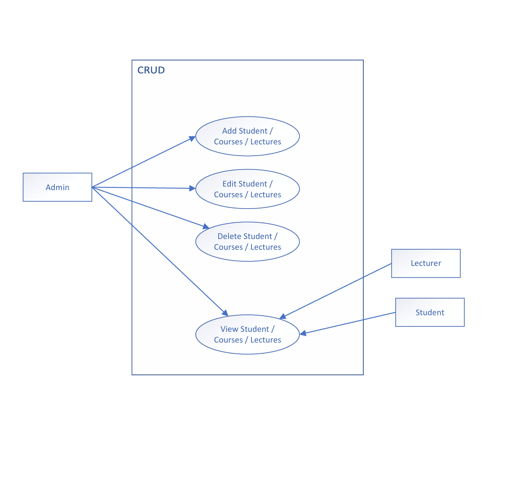

## Week 3 – Activity 4, incorporating a database sqlite3 and have at least three functionality 
such as add records, delete records and view records for different tables.

Run for the First Time

python main.py

This will automatically create the database (school.db) and the required tables.

Menu Options

Main Menu (Actors)

    1 → Manage Admin

    2 → Manage Students

    3 → Manage Lectures

    0 → Exit

Inside each menu (Admin) - (Cases):

    1 → Add record

    2 → View all records

    3 → Edit record

    4 → Delete record

    0 → Back to main menu

Inside each menu (Students/Lectures) - (Cases):

    1 → View all records (Students/Lectures)

    0 → Back to main menu

## Diagram 

